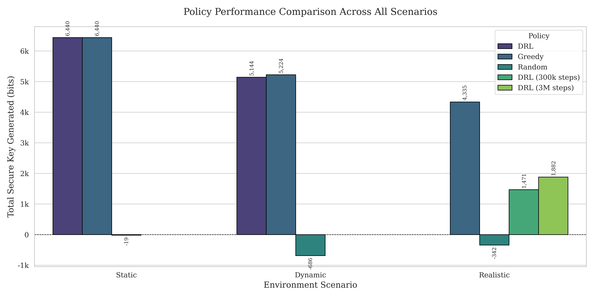
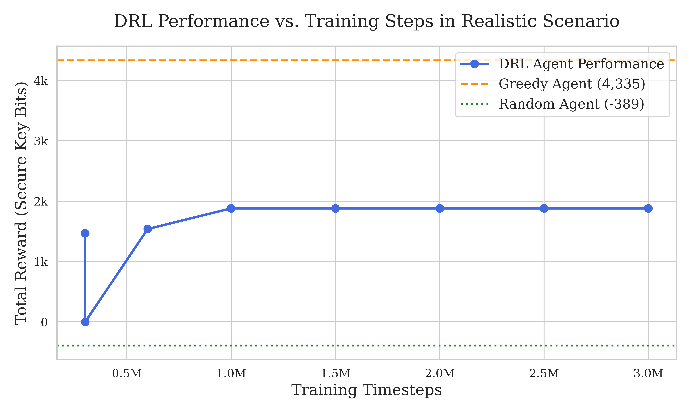

# AILET Paper: An Empirical Study of DRL for Satellite QKD Scheduling

This repository contains the official source code and experimental results for the paper *"An Empirical Study of Deep Reinforcement Learning for Dynamic Scheduling in Satellite QKD Networks"*, submitted to ACM AI Letters (AILET).

[](LICENSE)
[](https://www.python.org/downloads/)

## Overview

Quantum Key Distribution (QKD) via satellite is a promising technology for global secure communications. However, scheduling communication links is a complex task due to dynamic satellite orbits and unpredictable atmospheric conditions. This project investigates the potential and challenges of using Deep Reinforcement Learning (DRL) to create an autonomous scheduling agent for a satellite QKD network.

Through a series of increasingly complex simulation scenarios, we conduct an empirical study that reveals key insights into the application of DRL for this problem:
1.  **Effectiveness in Simple Scenarios:** DRL agents successfully learn optimal or near-optimal policies in environments with predictable dynamics.
2.  **The Challenge of Real-world Constraints:** The introduction of realistic operational constraints, such as link switching costs, fundamentally increases the problem's complexity, posing a significant challenge for standard DRL algorithms.
3.  **The Power and Limits of Deep Training:** We demonstrate that extensive training (up to 3 million timesteps) is crucial for the agent to learn effective strategies in complex scenarios. However, our results also highlight the surprising robustness of a well-designed greedy heuristic, which the DRL agent struggles to outperform, converging instead to a stable but suboptimal policy.

This work serves as a valuable case study on the application of DRL to real-world scheduling problems, underscoring the importance of environment design and highlighting the limitations of current learning-based approaches against strong, domain-specific baselines.

## Key Results

| Figure 1: Final Performance Comparison | Figure 2: DRL Performance vs. Training Steps |
| :---: | :---: |
|  |  |
*Left: Total reward comparison across three scenarios. Right: DRL agent's performance improvement with more training steps in the 'Realistic' scenario.*


## Repository Structure
```
.
├── models/                   # Saved trained models for each scenario
│   ├── static/
│   ├── dynamic/
│   ├── realistic/
│   └── realistic_3M/
├── logs/                     # TensorBoard logs for training runs
├── qkd_env.py                # The custom Gymnasium environment (v3.0)
├── train_long.py             # Script for the long (3M steps) training run
├── evaluate_final.py         # Script to reproduce final evaluation and plots
├── plot_checkpoint_performance.py # Script to generate the checkpoint performance plot
├── requirements.txt          # Python dependencies
└── README.md                 # This file
```

## Getting Started

### Prerequisites
- Python 3.10+
- NVIDIA GPU with CUDA drivers (strongly recommended for training)
- Conda (recommended for environment management)

### Installation
1.  **Clone the repository:**
    ```bash
    git clone https://github.com/ailabteam/AILET.git
    cd AILET
    ```

2.  **Create and activate the Conda environment:**
    ```bash
    conda create -n qkd_rl python=3.10 -y
    conda activate qkd_rl
    ```

3.  **Install dependencies:**
    First, install PyTorch compatible with your CUDA version. For CUDA 12.1:
    ```bash
    conda install pytorch torchvision torchaudio pytorch-cuda=12.1 -c pytorch -c nvidia -y
    ```
    Then, install the remaining packages. We provide a `requirements.txt` file for convenience.
    ```bash
    pip install -r requirements.txt
    ```
    *(You may need to create the `requirements.txt` file with `pip freeze > requirements.txt`)*

## Reproducing Results

The workflow is divided into two main stages: training the models and evaluating them.

### 1. Training the Models (Optional, time-consuming)

The pre-trained models are already included in this repository's history (if you push them). However, if you wish to retrain them from scratch, you can use the provided scripts.

**Note:** The full training process, especially the 3 million step run, can take several hours.

```bash
# To run the long training for the realistic model
python train_long.py 

# To run the shorter training for all three models (as in the original `train.py`)
# python train.py 
```

### 2. Evaluating and Generating Plots

This is the main step to reproduce the figures and tables from our paper.

1.  **Generate Final Comparison Plot (Figure 3 in paper):**
    This script evaluates all final models (`static`, `dynamic`, `realistic`, `realistic_3M`) and their corresponding baselines to generate the main results plot and a LaTeX table.
    ```bash
    python evaluate_final.py
    ```
    This will produce `final_comparison_with_3M_model.png` and print the LaTeX table code to the console.

2.  **Generate Checkpoint Performance Plot (Figure 2 in paper):**
    This script evaluates the saved checkpoints from the long training run to show how performance improves with experience.
    ```bash
    python plot_checkpoint_performance.py
    ```
    This will produce `checkpoint_performance_plot.png`.

## Citation
If you find this work useful in your research, please consider citing our paper:
```bibtex
@article{Do2025AILET,
  author    = {Do, Phuc Hao},
  title     = {An Empirical Study of Deep Reinforcement Learning for Dynamic Scheduling in Satellite QKD Networks},
  journal   = {ACM AI Letters},
  year      = {2025},
  % To be updated upon publication
}
```
